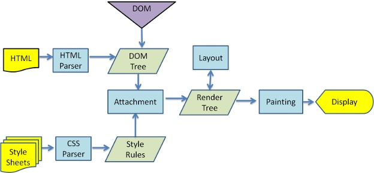
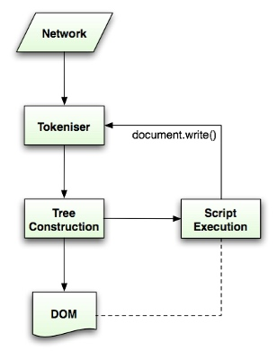
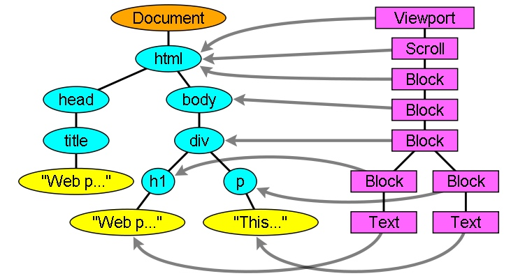

# 浏览器渲染过程

这里主要记录与优化相关部分


## 基本流程


## HTML Parser

`HTML` 会被解析成 `DOM tree`。就是将 `html` 字符串解析成符合 `W3C` 规范的 `node` (节点) 组成的树。要注意的是，`HTML` 虽然语法很宽松，会尽量包容不规范的写法，但这会造成解析的负担。所以，要书写符合规范的 `HTML` 代码。

另外，`script` 便签会阻塞 `DOM` 解析，具体到解析流程上是：




`Tokeniser` 是词法解析，`Tree Construction` 可理解是语法解析。

在解析流程上， `script`  会阻塞 `DOM` 继续解析，网上有些说法指出因为 `js` 可能会操作 `DOM` , 会影响已构建好的 `DOM tree`。

> 个人认为， 操作 `DOM tree` 不是它被针对的根本原因。 因为`DOM tree` 的构建是个持续的过程，不是解析完所有标签，再统一构建树，而是解析完一个标签，就会把它放到 `DOM tree` 里。所以，其他标签，本质上也会影响 `DOM tree` --- 也会 “操作” `DOM`。但在谈到优化时，着重提到 `script` 对 `DOM tree` 的影响, 应该是因为 `script` 标签，它不像其他一般标签一样是静态的描述指令，很快执行完，它能执行脚本，能做很多事，可能会很耗时，导致用户无法快速看到界面，伤害用户体验。所以，`script` 对 `DOM tree` 的影响被放大，被视为优化的对象了。

`要补充`， 按标签解析。
然后链接 `js` 里加载其他 `js` 脚本


 
## CSS parsing

样式加载会阻塞 `DOM` 解析


## Render tree construction

This tree is of **visual** elements in the order in which they will be displayed. It is the visual representation of the document. _The purpose of this tree is to **enable** painting the contents in their correct order_. 


### the render tree relation to the DOM tree

`DOM tree` 和 `render tree` 不是一对一的关系。

比如 `select`, 对应多个 `render` 对象。


> 据我目前了解，还没发现 一个 `render obj` 对应多个 `dom` 节点。


`render obj` 和 `dom node` 位置可能不一一对应，因为 `float` 绝对定位

> Some render objects correspond to a DOM node but not in the same place in the tree. Floats and absolutely positioned elements are out of flow, placed in a different part of the tree, and mapped to the real frame. A placeholder frame is where they should have been.



Figure : The render tree and the corresponding DOM tree (3.1). The "Viewport" is the initial containing block. In WebKit it will be the "RenderView" object


### 构建 render tree 的流程

`webkit` 里先解析 `html` 和 `body` 生成 `root render object`， 也就是 `css` 里说的 `containing block`， 它的尺寸是浏览器窗口尺寸。 ( `body` 高度不等于浏览器窗口高， 是规则有变，还是 `body` 和 `root render object` 就不是一回事？)

其他的，会调用节点的 `attach` 方法，插入到 `render tree` 里

> `attach` 是插入节点，不包括添加样式啊

### 样式计算


Building the render tree requires calculating the visual properties of each render object. _This is done by calculating the style properties of each element._ (然后怎么添到到 `render tree` 里)


计算的难点：

1. 样式数据很多，都存在内存里可能导致内存问题（移动端可能有这个问题，pc上应该不存在吧）
2. 为每个元素找到匹配的规则，计算量也大可能导致性能问题。
3. 给找到的规则排优先级，计算量也大。


对应的策略

1. Sharing style data (WebKit)

	```
	1. The elements must be in the same mouse state (e.g., one can't be in :hover while the other isn't)
	2. Neither element should have an id
	3. The tag names should match
	4. The class attributes should match
	5. The set of mapped attributes must be identical
	6. The link states must match
	7. The focus states must match
	8. Neither element should be affected by attribute selectors, where affected is defined as having any selector match that uses an attribute selector in any position within the selector at all
	9. There must be no inline style attribute on the elements
	10. There must be no sibling selectors in use at all. WebCore simply throws a global switch when any sibling selector is encountered and disables style sharing for the entire document when they are present. This includes the + selector and selectors like :first-child and :last-child.
	
	```


2. Manipulating the rules for an easy match

	分表(hash map)存, 按 `id`、`class`、`tag` 、其他分类。
		
	然后查找时就容易些
		
		
	从右到左的匹配规则，可以关注下
		


3. 排级

	好像是个覆盖的过程，`style` 下所有的属性都有值存在。

	> The style object has properties corresponding to every visual attribute (all CSS attributes but more generic). If the property is not defined by any of the matched rules, then some properties can be inherited by the parent element style object. Other properties have default values.
	
	> The problem begins when there is more than one definition–here comes the cascade order to solve the issue.

	
	1. Applying the rules in the correct cascade order
	2. Style sheet cascade order

		1. Browser declarations
		2. User normal declarations
		3. Author normal declarations
		4. Author important declarations
		5. User important declarations

4. 渐进式处理

	`WebKit` 使用一个标记来表示是否所有的顶级样式表（包括 @imports）均已加载完毕。如果在 `attach`中尚未完全加载样式，则使用占位符，并在文档中进行标注，等样式表加载完毕后再重新计算。
	
	> `script` 里加载应该也一样。解析 `script` 标签，如果里面有加载其他标签，并要加到 `body` 上去。会先把元素添加上去，然后等资源加载完了，再执行脚本(如果在 `DOM tree` 构建完之前资源回来了，应该会阻止渲染吧，先执行代码。这是个`defer` 的兼容性处理办法？)。
	
	
	> 	**感觉跟事件循环很像**

## Layout
When the renderer is created and added to the tree, it does not have a position and size. Calculating these values is called layout or reflow. (没有位置和大小， 应该是没有相对窗口的位置和大小吧。 有些元素是显式设置了宽度和位置，但也有些是没有的，比如html,body, 比如一些 行内元素。即使设置了宽，1px 等于多少，还得另算呢)


一般元素一次遍历可知位置，但 `table` 需要多次，所以性能不好。

> HTML uses a flow based layout model, meaning that most of the time it is possible to compute the geometry in a single pass. Elements later ``in the flow'' typically do not affect the geometry of elements that are earlier ``in the flow'', so layout can proceed left-to-right, top-to-bottom through the document. There are exceptions: for example, HTML tables may require more than one pass (3.5).


All renderers have a "layout" or "reflow" method, each renderer invokes the layout method of its children that need layout

### Dirty bit system

自己或子级有变化就标记下

### Global and incremental layout

1. Global

	**字号**或者屏幕大小改变，会引起全局重排

	1. A global style change that affects all renderers, like a font size change.
	2. As a result of a screen being resized

2. incremental

	如新插入`dom`元素

### 异步布局和同步布局
**增量布局是异步执行的**。Firefox 将增量布局的“reflow 命令”加入队列，而调度程序会触发这些命令的批量执行。WebKit 也有用于执行增量布局的计时器：对呈现树进行遍历，并对 dirty 呈现器进行布局。 (所以，会)
请求样式信息（例如“offsetHeight”）的脚本可同步触发增量布局。 
**全局布局往往是同步触发的。** 
有时，当初始布局完成之后，如果一些属性（如滚动位置）发生变化，布局就会作为回调而触发。


### 换行

如果呈现器在布局过程中需要换行，会立即停止布局，并告知其父代需要换行。父代会创建额外的呈现器，并对其调用布局。

> When a renderer in the middle of a layout decides that it needs to break, the renderer stops and propagates to the layout's parent that it needs to be broken. The parent creates the extra renderers and calls layout on them.

> 所以存在一个元素对应多个`render obj` ?


### layout 总结

1. 分全局layout和局部layout
2. 局部的，`dirty` 标记
3. 局部的是异步的，会批量处理

## Painting
`render tree` 会被遍历好几次啊，layout，painting时都会


In the painting stage, the render tree is `traversed` and the renderer's "paint()" method is called to display content on the screen. Painting uses the **UI infrastructure** component.

### 全局绘制和增量绘制

和布局一样，绘制也分为全局（绘制整个呈现树）和增量两种。

> 在增量绘制中，部分呈现器发生了更改，但是不会影响整个树。更改后的呈现器将其在屏幕上对应的矩形区域设为无效，这导致 OS 将其视为一块“dirty 区域”，并生成“paint”事件。OS 会很巧妙地将多个区域合并成一个。在 Chrome 浏览器中，情况要更复杂一些，因为 Chrome 浏览器的呈现器不在主进程上。Chrome 浏览器会在某种程度上模拟 OS 的行为。展示层会侦听这些事件，并将消息委托给呈现根节点。然后遍历呈现树，直到找到相关的呈现器，该呈现器会重新绘制自己（通常也包括其子代）

## 动态变化

在发生变化时，浏览器会尽可能做出最小的响应。因此，元素的颜色改变后，只会对该元素进行重绘。元素的位置改变后，只会对该元素及其子元素（可能还有同级元素）进行布局和重绘。添加 DOM 节点后，会对该节点进行布局和重绘。一些重大变化（例如增大“html”元素的字体）会导致缓存无效，使得整个呈现树都会进行重新布局和绘制。

> 所以有些是部分影响，有些事全局影响

## 呈现引擎的线程

呈现引擎采用了单线程。几乎所有操作（`除了网络操作`）都是在 **单线程** 中进行的。在 Firefox 和 Safari 中，该线程就是浏览器的主线程。而在 Chrome 浏览器中，该线程是标签进程的主线程。 
网络操作可由多个并行线程执行。并行连接数是有限的（通常为 2 至 6 个，以 Firefox 3 为例是 6 个）

### 事件循环

浏览器的主线程是事件循环。它是一个无限循环，永远处于接受处理状态，并等待事件（如布局和绘制事件）发生，并进行处理

**注意** 浏览器的渲染，也存在事件循环

## CSS2 可视化模型

### CSS 盒模型

### Positioning scheme
1. Normal： the object is positioned according to its place in the document
2. Float：the object is first laid out like normal flow, then moved as far left or right as possible
3. Absolute：the object is put in the render tree in a different place than in the DOM tree


盒子的布局方式是由以下因素决定的

1. 框类型
2. 框尺寸
3. 定位方案
4. 外部信息，例如图片大小和屏幕大小

### 盒子类型

1. Block box: forms a block–has its own rectangle in the browser window.
2. Inline box: does not have its own block, but is inside a containing block.

`inline-block` 呢

### Layered representation

这些框分散到多个堆栈（称为堆栈上下文）中。在每一个堆栈中，会首先绘制后面的元素，然后在顶部绘制前面的元素，以便更靠近用户。如果出现重叠，新绘制的元素就会覆盖之前的元素。 
堆栈是按照 z-index 属性进行排序的。具有“z-index”属性的框形成了本地堆栈。视口具有外部堆栈。


> 就是说，层级高的元素会优先绘制

## 参考

[How Browsers Work: Behind the scenes of modern web browsers](https://www.html5rocks.com/en/tutorials/internals/howbrowserswork/)

